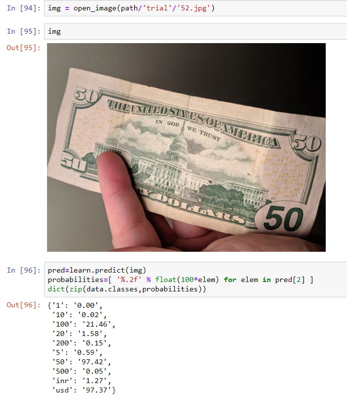

# aiSight
Banknote Denomination Recognition for the visually underprivileged

* Machine Learning model using Adam, ReLU, Softmax, Cyclical Learning Rates with SOTA and other Transfer Learning techniques for detection, recognition of valid INR and USD.

* Model exported to [PyTorch Script](https://drive.google.com/uc?export=download&id=1q6Yk4zLA1sk0vcFF1m6Z9v5_2_dXSFIj) and deployed as a [Mobile Application](https://github.com/mayhem-am/envision) using Dart and as a [Web Application](https://github.com/mayhem-am/vision) using Render.

To convert ipython notebook to html or pdf use LaTeX or
```bash
jupyter nbconvert --to html "file_name".ipynb
```

# Objective : 
* Relay INR or USD banknote denomination if valid, retry otherwise

# Inference

* Notched accuracy upto 90%, not bad for a multi-label ResNet-34 classification model


* Trivial INR Softmax out


* Trivial USD Softmax out


* F-Beta score - more weight on precision, less on recall


# Goals :

- [x] dataset collection upto a valid amount (>200)
- [x] model accuracy upto 90%
- [x] accuracy stays unchanged for unbalanced classes
- [x] perspective warping
- [ ] Grad-CAM
- [ ] improve accuracy with custom-nn/resnet101 and larger dataset
- [x] deploy on Android/iOS
- [ ] low bandwidth performance improvement
- [ ] minimize false negative probability (recall percentage)


