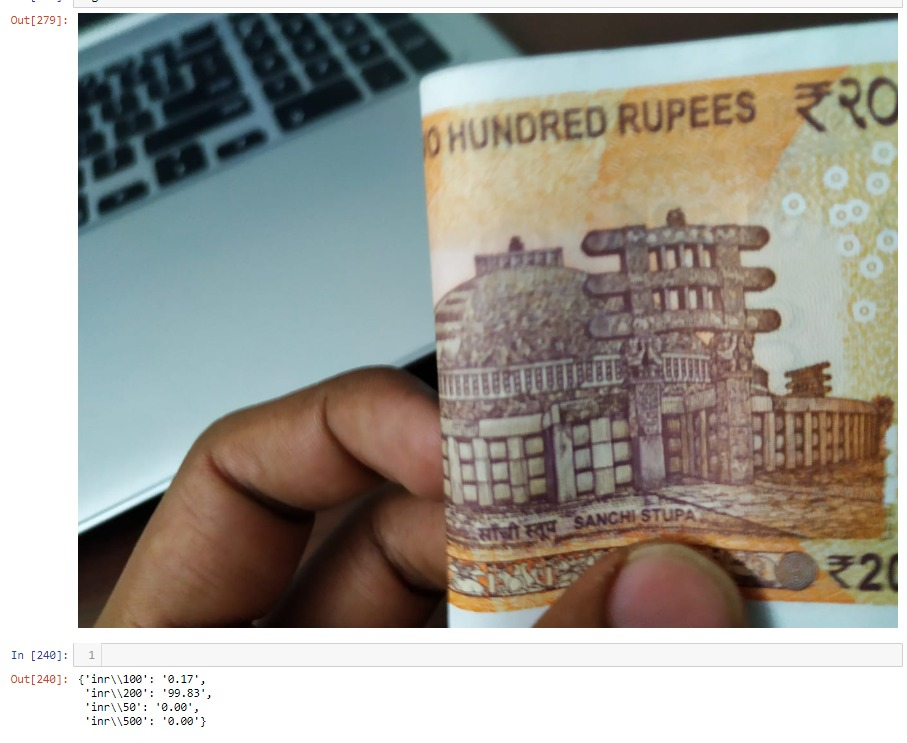

# Multi class Classification
* Dataset obtained from Kaggle, Google_images and manual clicking of pictures - [Dataset](https://drive.google.com/open?id=1olOGcwvplO4enCL0pMsyB04C8BvWZVuz)

* Model testing done on Colab (Google Compute Engine >12GB RAM >100GB RAM), [multi_class.ipynb](https://drive.google.com/open?id=19Hqh9BiE5ziKzftuaDTw796_so2SQ2kv)
* Softmax Classifier
* Model testing and inference done [locally](https://drive.google.com/open?id=19IunNDU7l65StLmFrnFO4UVlTuzRhCyn) without breaking anything :) 

* Accuracy obtained upto 92% with low loss without overfitting

* Final Confusion matrix 

* Trivial case probabilities

* Non-Trivial case probabilities, Softmax regularises output

